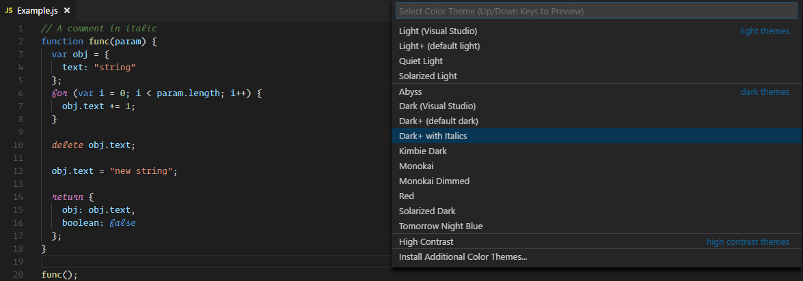

# Dark+ Theme With Italics for Visual Studio Code

### Updated Dark+ Theme with Some Italics and No Bolds. Perfect for 'Operator Mono Light' font.

1. Open Command Palette (Ctrl+Shift+P)
2. Choose 'Preferences: Color Theme'

  

